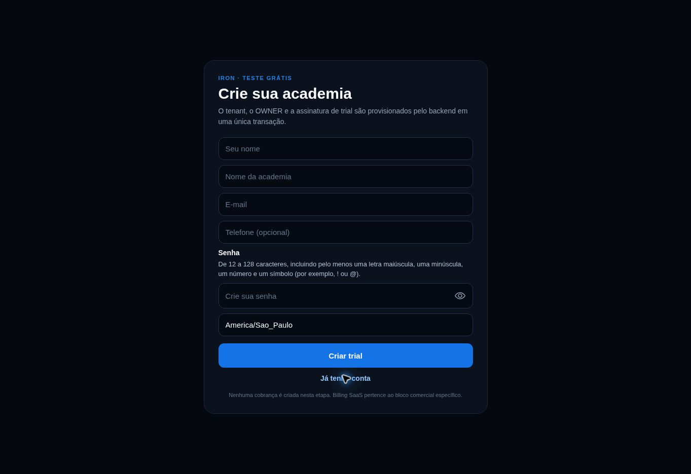

# Macro O — Checkpoint de revisão visual

## Estado

- Gate reconciliado: Macro O em execução, a partir de O0. O23 ainda não está liberado; houve apenas revisão parcial de autenticação.
- Merge: proibido até aprovação visual explícita.
- Referência observada em 29/09/2026: `image(20260929-201841).png`.

## Pendência registrada — autenticação Web

A tela atual de login do preview é funcional, mas não atende ao padrão visual Premium esperado para o IRON FIT CORE.

Pontos confirmados na captura:

- composição excessivamente ampla e vazia em desktop;
- hierarquia, proporções e acabamento ainda genéricos;
- marca apresentada sem o ativo oficial final e sem presença premium;
- card, campos, botões, espaçamento e tipografia precisam de refinamento;
- a próxima revisão deve preservar a identidade azul oficial do IRON e eliminar aparência de interface provisória;
- a referência visual premium que será fornecida pelo usuário deve orientar a evolução desta superfície.

## Regra de execução

O upgrade deve ser aplicado diretamente à superfície real de autenticação existente, sem criar demo, aplicação paralela ou alterar os contratos de autenticação, sessão, tenant, RBAC ou backend.

## Referência premium recebida

- Referência recebida em 29/09/2026: `Imagem do ChatGPT 29 de set. de 2026, 17_21_12.png`.
- Origem conceitual: linguagem visual escolhida para NFCORE e Command.
- Decisão de direção: usar como DNA visual compartilhado da família FM, sem copiar a composição funcional do Command para o IRON.

Elementos aproveitáveis no IRON:

- base azul-marinho profunda com contraste alto;
- contornos luminosos azuis e ciano, preservando a proibição de roxo histórico do Prompt Mestre vigente;
- painéis densos, organizados e com profundidade visual;
- tipografia clara, hierarquia forte e estados operacionais legíveis;
- sensação de inteligência, tecnologia, robustez e produto premium;
- consistência de navegação, cards, indicadores, badges e feedbacks.

Adaptação obrigatória para identidade própria do IRON:

- predominância do azul oficial do IRON, sem retomar o roxo histórico como cor dominante;
- iconografia, ilustrações e linguagem ligadas a força, treino, evolução e operação de academia;
- composição específica por módulo, evitando transformar todas as telas no mesmo dashboard;
- autenticação mais limpa e emocional que o cockpit, mantendo o acabamento premium da mesma família;
- marca e ativos oficiais do IRON no lugar da identidade Command/Core.

## Reconciliação de 29/09 — retomada final

Ver `IRON_RECONCILIACAO_CURRENT_2026-09-29.md`. O componente real ainda possuía um ramo `demoPreview`; sua remoção é O0, não fechamento do Macro O. JSON bruto, logo oficial e superfícies funcionais continuam no backlog.

## Atualização de execução — preview real

Código app 1cebac79207c73198c51566f3eee418a8fb73b7f publicado no Render, deploy dep-dau3oflg1s2s73bb90kg LIVE. Controles Mostrar/Ocultar senha verificados no login e trial com os campos vazios. Backend corrigido pelas PRs #110 e #111; readiness HTTP 200 e cinco módulos antes afetados revalidados por leitura real. Integrações ainda falha por schema incompleto. Detalhes, limites e migrations pendentes em `IRON_EVIDENCIAS_RETOMADA_2026-09-29.md`.

O23 continua bloqueado. Esta captura registra a implementação publicada, não aprovação do visual final.
